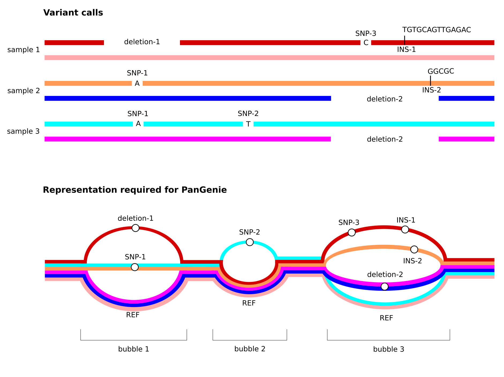

===========
Background
===========

In this workshop we will learn how to work with PanGenie. PanGenie is a short-read genotyper for various types of genetic variants (such as SNPs, indels and structural variants) represented in a pangenome graph. Genotypes are computed based on read k-mer counts and a panel of known, fully assembled haplotypes present in the graph. Our focus will be on how to run PanGenie rather than the underlying method. For a description of the method we refer to our publication: https://doi.org/10.1038/s41588-022-01043-w. PanGenie is available on github (https://github.com/eblerjana/pangenie). All information on how to install it is available there.

-----------
Input data
-----------

Reads
=====

PanGenie relies on k-mer count information and thus requires accurate sequencing reads. Therefore, we strongly recommend to use it with short reads only, in principle however, it is not restricted to short reads. PanGenie is alignment-free. Therefore, it expects unaligned reads in FASTA or FASTQ format. 

Pangenome reference
====================
PanGenie works with a directed and acyclic pangenome reference. It expects the pangenome graph to be represented in terms of a VCF file with the properties listed above. If you are not familiar with the VCF format, we refer you to the VCF specifications: https://samtools.github.io/hts-specs/VCFv4.2.pdf

* **multi-sample**: The VCF file must contain haplotype information of at least one known sample, as PanGenie makes use of the haplotype information inherent in the pangenome reference.

* **fully phased**: haplotype information of graph samples is represented by phased genotypes and each sample must be phased in **one single block** (i.e. from start to end of the chromosomes).

* **non-overlapping variants**: The VCF is expected to represent top-level bubbles of a pangenome graph. Therefore, all overlapping variant alleles must be represented in terms of a single, multi-allelic variant record.

* **sequence-resolved**: The REF and ALT sequences need to be explicitly provided (i.e. symbolic records are not allowed.)

Note especially the third point listed above. Below, we illustrate how PanGenie expects overlapping variant alleles to be represented in terms of a graph.

In the following sections, we will explain in detail how to produce such input VCFs starting either from phased assemblies or from a pangenome graph generated with the Minigraph-Cactus pipeline. However, in general any VCF with the properties listed above can be used as input to PanGenie.

Reference genome
================

PanGenie also needs to be provided with the reference genome corresponding to the pangenome VCF. This file is expected to be in FASTA format.

----------------------------------
Constructing PanGenie input VCFs
----------------------------------

TODO
