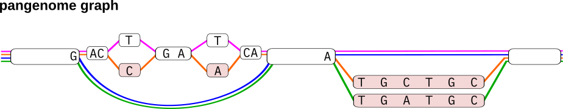
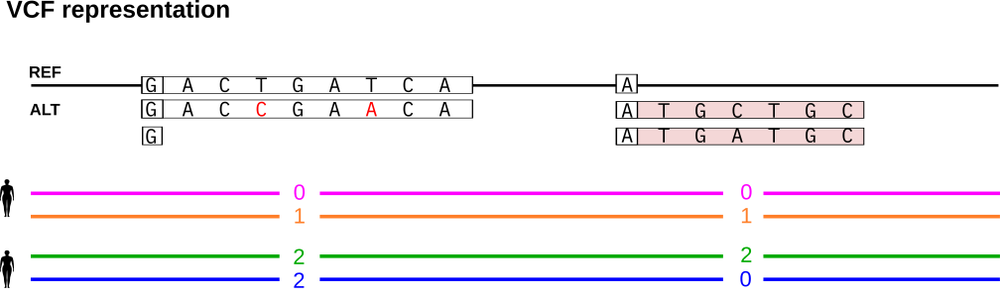
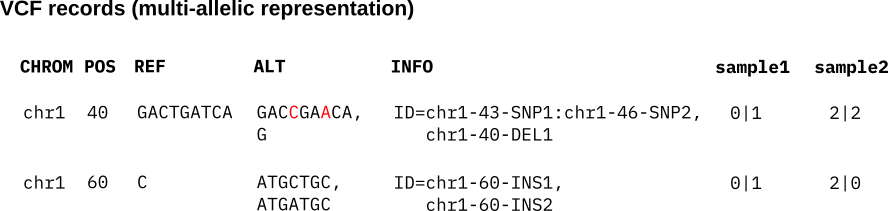
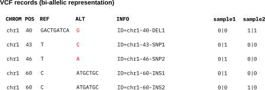

===========
Background
===========

In this workshop we will learn how to work with PanGenie. PanGenie is a short-read genotyper for various types of genetic variants (such as SNPs, indels and structural variants) represented in a pangenome graph. Genotypes are computed based on read k-mer counts and a panel of known, fully assembled haplotypes present in the graph. Our focus will be on how to run PanGenie rather than the underlying method. For a description of the method we refer to our publication: https://doi.org/10.1038/s41588-022-01043-w. PanGenie is available on github (https://github.com/eblerjana/pangenie). All information on how to install it is available there.

-----------
Input data
-----------

Reads
=====

PanGenie relies on k-mer count information and thus requires accurate sequencing reads. Therefore, we strongly recommend to use it with short reads only, in principle however, it is not restricted to short reads. PanGenie is alignment-free. Therefore, it expects unaligned reads in FASTA or FASTQ format.

Reference genome
================

PanGenie also needs to be provided with the reference genome corresponding to the pangenome VCF. This file is expected to be in FASTA format.

Pangenome reference
====================

PanGenie works with a directed and acyclic pangenome reference. It expects the pangenome graph to be represented in terms of a VCF file with the properties listed above. If you are not familiar with the VCF format, we refer you to the VCF specifications: https://samtools.github.io/hts-specs/VCFv4.2.pdf.

* **multi-sample**: The VCF file must contain haplotype information of at least one known sample, as PanGenie makes use of the haplotype information inherent in the pangenome reference.

* **fully phased**: haplotype information of graph samples is represented by phased genotypes and each sample must be phased in **one single block** (i.e. from start to end of the chromosomes).

* **non-overlapping variants**: The VCF is expected to represent top-level bubbles of a pangenome graph. Therefore, all overlapping variant alleles must be represented in terms of a single, multi-allelic variant record.

* **sequence-resolved**: The REF and ALT sequences need to be explicitly provided (i.e. symbolic records are not allowed.)

Any VCF with the properties listed above can be used as input to PanGenie. In this workshop however, we will especially focus on VCFs with additional annotations with allow to convert the genotypes PanGenie computes for all bubbles to genotypes for all variants nested inside of bubbles in the graph (bubble decomposition). Again, these annotations are not mandatory for running PanGenie, but they are useful for downstream analyses. For this workshop, we will not focus on how to create such annotated VCFs and refer the reader to the `PanGenie documentation <https://github.com/eblerjana/pangenie>`_.

 
In the following section, we will explain how such annotated VCFs encode pangenome bubbles and their nested variation.

----------------------------------------------------
Representing nested variation
----------------------------------------------------

Pangenome graph construction tools like the Minigraph-Cactus pipeline build pangenomes from haplotype-resolved de novo assemblies. Variation between haplotypes is represented in terms of bubble structures in the graph. Each haplotype is additionally stored as a path through the graph. In the example shown below, the graph represents four haplotypes (shown in pink, orange, green and blue) and two top-level bubble structures. 

In VCF representation, each top-level bubble is encoded as a separate record. Each path through the bubble covered by at least one haplotype is listed as an alternative allele. The reference allele refers to the sequence of the path that the reference genome follows through the graph. The haplotypes are encoded in terms of phased genotypes in the sample columns of the VCF.

We show how to represent the records in VCF format. The first bubble contains two nested SNP variants. We can assign a unique ID to each individual variant allele and encode nested variation in the INFO/ID field. This field has one entry for each alternative allele listed in the ALT column of the VCF. If the alternative allele contains nested variants, the IDs of these nested alleles are listed, separated by a colon. If there are no nested alleles, the ID field just contains a single ID. See the Figure below for an example. The first bubble record consists of two alternative alleles. The first ALT allele corresponds to the path of the orange haplotype and thus traverses the two nested SNP variants. Therefore, its INFO/ID field lists the IDs of these two SNPs, separated by a colon. The second alternative allele refers to the deletion (the path taken by the blue and green haplotypes) and does not contain any further nested alleles. Therefore, the INFO/ID column just consists of a single ID, corresponding to the deletion itself.
We refer to this annotated VCF as the **bubble VCF** in the following.

Instead of representing each bubble as a record in the VCF, an alternative is to convert the VCF into a bi-allelic representation which contains a separate record for each individual (nested) allele, i.e. one record per unique ID. See below for the bi-allelic representation of the above VCF records. Each individual ID is listed as a separate record with its corresponding REF and ALT sequences. The bubble genotypes are translated into bi-allelic genotypes encoding the presence (1) and absence (0) of each individual variant ID in the haplotypes. We refer to this bi-allelic VCF as the **callset VCF** in the following.

We can genotype bubbles in the pangenome graph with PanGenie using the annotated, multi-allelic *bubble VCF* as input. After genotyping, we can postprocess the VCF to convert bubble genotypes to genotypes for each individual variant allele represented in the *callset VCF*.

**Note:** these annotations are useful in many cases, but PanGenie can still be run on VCFs not containing them. In fact, the annotations are not used by PanGenie. They just enable an additional postprocessing step which helps analyzing variation encoded inside of bubbles and we will show how to do this below.

-------------------------
Genotyping with PanGenie
-------------------------

The recommended way of running PanGenie is to first run a preprocessing step with ``PanGenie-index`` and then the genotyping step using the command ``PanGenie``::

    PanGenie-index -v <variants.vcf> -r <reference.fa> -t <number of threads> -o <outfile-prefix>
    PanGenie -f <outfile-prefix>` -i <reads.fa/fq>  -s <sample-name> -j <nr threads kmer-counting> -t <nr threads genotyping>

We will explain both commands in more detail in the following paragraphs.

Preprocessing step
===================

During preprocessing, steps unrelated to the genotyped sample(s) are performed, like processing the input variants and determining unique k-mers in the graph. In a setting in which the same set of input variants are genotyped across multiple samples, the advantage is that this preprocessing step needs to be run only once. The preprocessing step can be run using the command PanGenie-index::

 PanGenie-index -v <variants.vcf> -r <reference.fa> -t <number of threads> -o <outfile-prefix>

The pre-proccessing step will result in a set of files (listed below) that can be used by PanGenie in order to genotype a specific sample:

    * ``<outfile-prefix>_<chromosome>_Graph.cereal`` (one for each chromosome) serialization of Graph object
    * ``<outfile-prefix>_<chromosome>_kmers.tsv.gz`` (one for each chromosome) containing unique k-mers
    * ``<outfile-prefix>_UniqueKmersMap.cereal`` serialization of UniqueKmersMap object
    * ``<outfile-prefix>_path_segments.fasta`` containing all reference and allele sequences of the graph

You don't need to understand what any of these files represent. They mainly contain information important to the subsequent genotyping step and PanGenie automatically processes them while running. So the only important thing is to not delete them prior to running PanGenie.

Genotyping step
================

After preprocessing is completed, the genotyping step can be run in order to genotype a specific sample. If multiple samples shall be genotyped, this step needs to be run on each of these samples separately (while the preprocessing needs to be done only once). Based on the sequencing reads of a sample and the pre-computed files, genotyping is run using the command PanGenie with option ``-f``::

    PanGenie -f <outfile-prefix> -i <reads.fa/fq> -s <sample-name> -j <nr threads kmer-counting> -t <nr threads genotyping>

The result will be a VCF file containing genotypes of the sample for the variants provided in the input VCF. Per default, the name of the output VCF is result_genotyping.vcf. You can specify the prefix of the output file using option ``-o <prefix>``, i.e. the output file will be named as ``<prefix>_genotyping.vcf`` . The full list of options is provided below.

If you want to genotype the same set of variants across more than one sample, run the command above separately on each sample. The preprocessing step only needs to be run once (as long as the VCF does not change).

Genotyping nested variation
============================

For input VCFs containing annotations as described above, PanGenie is run using the same commands shown above. However, we can add an additional step after genotyping which converts the genotypes PanGenie computes for all bubbles in the graph to genotypes of all nested variant alleles represented in the bubbles. Note that this step only works if the VCF has these specific annotations explained above. 

Postprocessing can be run as:: 

    cat pangenie_genotyping.vcf | python3 convert-to-biallelic.py <callset-VCF> > pangenie_genotyping_biallelic.vcf

The script ``convert-to-biallelic.py`` is provided `here <https://github.com/eblerjana/pangenie/blob/master/pipelines/run-from-callset/scripts/convert-to-biallelic.py>`_.

The result is a bi-allelic VCF containing a separate record for each individual variant ID contained in the *callset VCF*, with a genotype assigned. These genotypes are derived from the genotypes PanGenie computed for the respective bubble in the graph.
